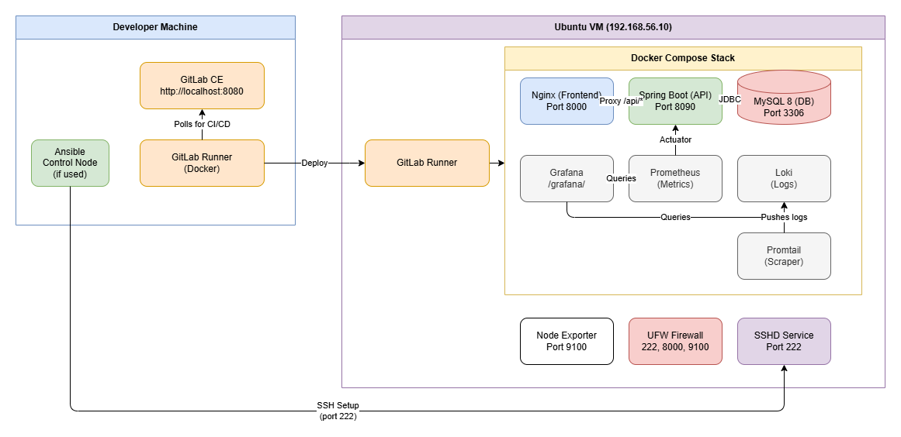
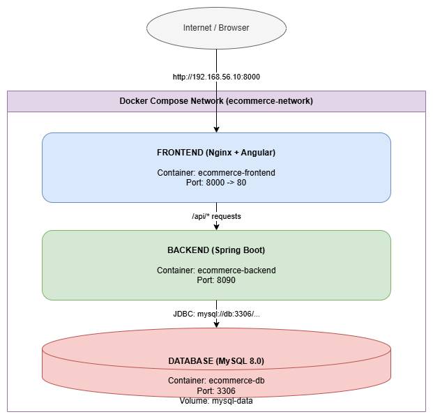

# Architecture & Data Flow

This document explains the complete system architecture, how every component interacts, and what happens at each stage — from initial setup to a production deployment triggered by a `git push`.

---

## System Overview

There are **two machines** involved:

| Machine | Role | What Runs On It |
|---------|------|-----------------|
| **Developer Machine** (laptop/desktop) | Development, GitLab hosting, Ansible control | GitLab CE, GitLab Runner, Vagrant, Ansible |
| **Ubuntu VM** (VirtualBox) | Production target | Docker, E-Commerce App, Node Exporter, UFW, SSHD |



---

## Phase 1: Infrastructure Setup

### What happens when you run `vagrant up`

```
1. vagrant up -> local host: download ubuntu/focal64 box
2. Create VM: 4GB RAM, 2 CPUs -> 192.168.56.10 -> port forwards: 222→2222, 8000→8000, 9100→9100
3. Run shell provisioner: apt install python3 python3-pip
4. VM ready, SSH key generated
```

**Result**: A bare Ubuntu 20.04 VM at `192.168.56.10`, accessible via `vagrant ssh` on port 22. Python 3 is installed (required by Ansible). Nothing else is configured yet.

### What happens when you run `ansible-playbook playbook.yml`

Ansible connects to the VM via SSH, or run from Vagrantfile `ansible-playbook playbook.yml`. and executes 5 roles in order:
- Role 1: docker
  * install docker
  * install docker compose
  * add vagrant user to docker group
  * systemctl enable docker
  * pip install docker (Python SDK)
        
- Role 2: node_exporter
  * download binary from GitHub
  * install to /usr/local/bin/
  * create systemd service file
  * systemctl enable node_exporter
  * clean up /tmp downloads
        
- Role 3: sshd
  * template sshd_config (Port 222)
  * validate config (sshd -t)
  * restart sshd → NOW ON PORT 222
        
- Role 4: ufw
  * apt install ufw
  * default: deny incoming
  * allow: 222 (SSH)
  * allow: 8000 (App)
  * allow: 9100 (Node Exporter)
  * temp allow: 22 (safety net)
  * enable UFW
  * remove temp port 22 rule
        
- Role 5: gitlab_runner
  * add GitLab Runner GPG key + repo
  * apt install gitlab-runner
  * register (only if token provided)
  * systemctl enable gitlab-runner
        
        


**This order matters**:

```
WRONG ORDER would lock you out:
  ufw (blocks port 22) → sshd (tries to change to 222) = LOCKED OUT

CORRECT ORDER:
  sshd (SSH moves to 222) → ufw (blocks 22, allows 222) = OK
```

**Result**: The VM now has Docker, Node Exporter on port 9100, SSH on port 222, firewall blocking everything except 222/8000/9100, and GitLab Runner installed.

---

## Phase 2: GitLab Setup

### What happens when you start GitLab

```
cd gitlab/ && docker compose up -d
```
Docker on developer machine:
  - gitlab cd container
    * initializes PostgreSQL database
    * generates root password
    * starts Puma web server (port 8080)
    * starts Sidekiq (background jobs)
    * takes 3-5 minutes to fully start
  
  - gitlab runner cd container
    * installs gitlab-runner
    * registers the runner
    * systemctl enable gitlab-runner      

### Runner Registration Flow

```
You (Browser)              GitLab UI                  Runner Container
     │                        │                             │
     │  1. Open Admin Area    │                             │
     │  → CI/CD → Runners     │                             │
     ├───────────────────────▶│                             │
     │  2. Copy reg. token    │                             │
     │◀───────────────────────┤                             │
     │                        │                             │
     │  3. Run: ./register-runner.sh TOKEN                  │
     ├─────────────────────────────────────────────────────▶│
     │                        │  4. Runner sends token      │
     │                        │◀────────────────────────────┤
     │                        │  5. GitLab validates token  │
     │                        │  6. Returns runner config   │
     │                        ├────────────────────────────▶│
     │                        │  7. Runner starts polling   │
     │                        │◀────────────────────────────┤
     │                        │     "Any jobs for me?"      │
     │                        │     (every 3 seconds)       │
```

---

## Phase 3: Application Architecture (Docker Compose)

### Services Three




### Startup Sequence (Dependency Chain)

```
Time ──────────────────────────────────────────────────────────▶

MySQL (db)     ████████████████████████████████████████████████
               │ Start │ Init DB │ Ready (healthcheck passes) │
               0s      10s       30s

Backend        ░░░░░░░░░░░░░░░░░░████████████████████████████
               │ Waiting...     │ Start │ Connect DB │ Ready │
               (depends_on:     30s     33s          35s
                service_healthy)

Frontend       ░░░░░░░░░░░░░░░░░░░░░░░░░░░░░░░░░█████████████
               │ Waiting...                      │ Start │ OK │
               (depends_on: backend)             35s     36s
```

**Why healthcheck matters**: Without `depends_on: condition: service_healthy`, Docker would start the backend immediately after MySQL's container starts — but MySQL takes 15-30 seconds to initialize. The backend would crash with "Connection refused". The healthcheck (`mysqladmin ping`) ensures MySQL is actually accepting connections before the backend starts.

### The API Proxy Problem & Solution

The Angular source code has **hardcoded** API URLs:

```typescript
// frontend/angular-ecommerce/src/app/services/product.service.ts
private baseUrl = "http://localhost:8090/api/products";
private categoryUrl = "http://localhost:8090/api/product-category";
```

In Docker, `localhost` inside the browser means the user's machine, not the backend container. The backend is in a separate container with its own IP.

**Solution — Nginx reverse proxy**:

```
WITHOUT PROXY (broken):
  Browser http://localhost:8090/api/products
  Nothing listening on host port 8090 (or wrong container)  
  Causing connection ERROR

WITH PROXY (solution):
  Browser loads Angular from http://localhost:8000
  Angular calls http://localhost:8090/api/products
  Port 8090 IS exposed in docker-compose
  
  For production (VM deployment), Nginx also has:
  Nginx catches /api/*  proxy_pass http://backend:8090/api
  "backend" resolves via Docker DNS  172.18.0.3 (backend container IP)
```

We expose port 8090 in docker-compose **and** set up the Nginx proxy. The Angular app's hardcoded `localhost:8090` works because we forward that port, and the `/api` proxy works as an additional path.

---


## Network Topology

### Ports Summary

| Port | Service | Machine | Protocol | Access |
|------|---------|---------|----------|--------|
| 8000 | Nginx (Angular + proxy) | VM | HTTP | Public (UFW allows) |
| 8090 | Spring Boot API | VM | HTTP | Internal (Docker network) + exposed |
| 3306 | MySQL | VM | TCP | Internal (Docker network) + exposed |
| 9100 | Node Exporter | VM | HTTP | Public (UFW allows) |
| 222 | SSH | VM | TCP | Public (UFW allows) |
| 8080 | GitLab CE | Developer Machine | HTTP | Localhost only |
| 5050 | GitLab Registry | Developer Machine | HTTP | Localhost only |
| 2224 | GitLab SSH | Developer Machine | TCP | Localhost only |

### Docker Network Resolution

Inside the Docker Compose network, services find each other by name:

```
Container Name         DNS Name       IP (assigned by Docker)
ecommerce-frontend  →  frontend   →   172.18.0.4
ecommerce-backend   →  backend    →   172.18.0.3
ecommerce-db        →  db         →   172.18.0.2
```

When `nginx.conf` says `proxy_pass http://backend:8090`, Docker's internal DNS resolves `backend` to `172.18.0.3`. No hardcoded IPs needed.

---

## Security Layers

```
Internet
    │
    ▼
┌─────────┐
│   UFW   │  Firewall: only 222, 8000, 9100 allowed
│ (Layer 1)│
└────┬────┘
     │
     ▼
┌─────────┐
│  SSHD   │  Port 222 (non-standard reduces bot scanning)
│ (Layer 2)│  Key-based auth enabled, root password login disabled
└────┬────┘
     │
     ▼
┌─────────┐
│ Docker  │  Containers isolated from host filesystem
│ (Layer 3)│ communication via bridge network only
└────┬────┘
     │
     ▼
┌─────────┐
│  MySQL  │  User 'ecommerceapp' with app-specific password
│ (Layer 4)│  Root accessible only from within container
└─────────┘
```

---

## Phase 4: Monitoring and Observability (PLG Stack)

The system includes a centralized monitoring stack (Prometheus, Loki, Grafana) built directly into the Docker Compose file.

### Data Flow

```
[Application Logs]         [Hardware Stats]        [Spring Boot]
     (stdout)                (Node Exporter)        (Actuator)
        │                           │                    │
        ▼                           │                    │
  Docker Socket                     │                    │
        │                           │                    │
        ▼                           │                    │
 ┌────────────┐                     │                    │
 │  Promtail  │                     │                    │
 └──────┬─────┘                     │                    │
        │                           │                    │
        ▼                           ▼                    ▼
 ┌────────────┐              ┌─────────────────────────────────┐
 │   Loki     │              │           Prometheus            │
 │ (Log DB)   │              │          (Metrics DB)           │
 └──────┬─────┘              └────────────────┬────────────────┘
        │                                     │
        └──────────────────┬──────────────────┘
                           ▼
                    ┌────────────┐
                    │  Grafana   │
                    │  (Port 80) │
                    └──────┬─────┘
                           │
                    [Web Browser]
          http://192.168.56.10:8000/grafana/
```

1. **Metrics Collection (Prometheus)**: Prometheus scrapes `192.168.56.10:9100` (Node Exporter) for VM hardware metrics, and `backend:8090/actuator/prometheus` for application performance metrics.
2. **Log Aggregation (Promtail + Loki)**: Promtail reads `/var/run/docker.sock` to capture all container `stdout/stderr` streams, labeling them by container name, and pushes them to Loki.
3. **Visualization (Grafana)**: Nginx proxies the `/grafana/` route to the Grafana container. Grafana queries Loki and Prometheus to display real-time logs and graphs.

---

## Complete Timeline: Zero to Running App

```
Time    Action                                    Result
─────   ─────────────────────────────────         ──────────────────────
 0:00   vagrant up                                VM created
 5:00   cd gitlab/ && docker compose up -d        GitLab starting...
 8:00   GitLab fully started                      http://localhost:8080
 9:00   Create project in GitLab UI               Project exists
10:00   cd ansible/ && ansible-playbook ...        VM configured
15:00   Copy runner token from GitLab UI          Token obtained
15:30   ./register-runner.sh TOKEN                Runner registered
16:00   Set CI/CD variables in GitLab UI          SSH credentials stored
17:00   git push gitlab main                      Pipeline triggers
17:01   Build stage starts                        Docker images building
22:00   Build stage completes                     Images ready
22:01   Deploy stage starts                       SSH into VM
22:30   docker compose build on VM                Building on VM
32:00   docker compose up -d on VM                Containers starting
32:30   MySQL initialized                         DB ready
33:00   Backend connected to MySQL                API ready
33:01   Frontend serving                          App ready
        ───────────────────────────────
33:01   http://192.168.56.10:8000                 🎉 E-COMMERCE APP LIVE
        http://192.168.56.10:9100/metrics         📊 METRICS AVAILABLE
        ssh -p 222 vagrant@192.168.56.10          🔐 SSH ACCESS ON 222
```
