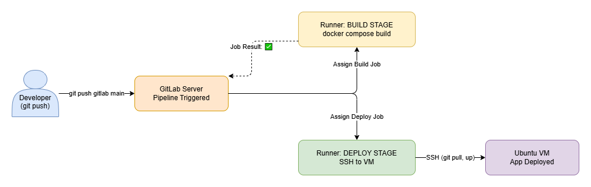

# CI/CD Pipeline

This project uses **GitLab CI/CD** to automatically build and deploy the e-commerce application.

## Environments

1. **Development**: Developers local host machine. Developers can test locally by running `docker compose up --build` inside the `ecommerce-app` directory.
2. **Production**: The Ubuntu VM (`192.168.56.10`). This is where the CI/CD pipeline deploys the application automatically when code is pushed to the `main` branch.

## Pipeline Architecture

**GitLab Runner is installed directly on the Production VM** and uses the `shell` executor. 

## Build and Deploy Process

The pipeline is defined in `.gitlab-ci.yml` and triggers automatically on `git push`.



Pipeline will build only particular services that are changed. If nothing changed it will not do anything. It will just skip the build stage and go to the deploy stage. Docker compose `up -d` command will only restart containers that have changed images or configuration.

### 1. Build
- **Command:** `docker compose build`
- **What happens:** The runner navigates to the `ecommerce-app/` directory and compiles the source code into fresh Docker images using the multi-stage Dockerfiles.

### 2. Deploy
- **Command:** `docker compose up -d`
- **What happens:** The runner instructs Docker to start the newly built containers. Docker automatically detects which images have changed and seamlessly replaces the running containers without dropping the database.

## Rollback Strategy

Because deployments are fully automated via Git, the best way to roll back a broken deployment is to **revert the Git commit**.

1. **Identify the broken commit** in your Git history.
2. **Revert the commit** locally:
   ```bash
   git log --oneline
   git revert <bad-commit-hash>
   ```
3. **Push the revert** to GitLab:
   ```bash
   git push origin main
   ```
4. **Result:** The CI/CD pipeline will automatically trigger, build the previously working state of the application, and deploy it to the VM in minutes. 

*(Alternative: Can manually SSH into the VM and use `docker image tag` to revert to an older image if a critical failure prevents the pipeline from running.)*
